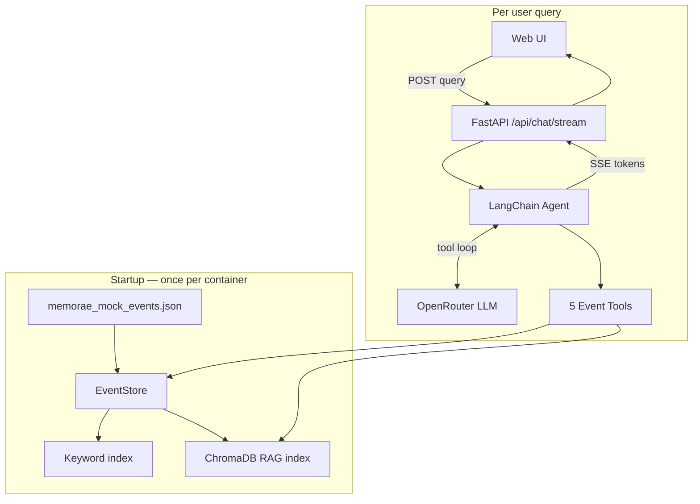

# Memorae Assignment — Design Document

This document explains **what Memorae does**, **how data flows from indexing to final answer**, and **every rule the agent follows**. It is written so that an engineer, reviewer, or product person can understand the system without reading the code first.

---

## Table of contents

1. [Problem statement](#1-problem-statement)
2. [Design principles](#2-design-principles)
3. [System overview](#3-system-overview)
4. [Phase 1 — Startup and indexing](#4-phase-1--startup-and-indexing)
5. [Phase 2 — User message arrives](#5-phase-2--user-message-arrives)
6. [Phase 3 — Agent tool loop](#6-phase-3--agent-tool-loop)
7. [Phase 4 — Answer and explanation](#7-phase-4--answer-and-explanation)
8. [The five tools (detailed)](#8-the-five-tools-detailed)
9. [Agent rules (complete)](#9-agent-rules-complete)
10. [Worked example](#10-worked-example)
11. [Streaming and UI](#11-streaming-and-ui)
12. [Failure modes](#12-failure-modes)

---

## 1. Problem statement

People's lives are scattered across messages. Important information — deadlines, asks, status changes — is buried in:

- WhatsApp threads with friends and colleagues
- Slack channels with noise (`#random`, lunch polls)
- Gmail with newsletters mixed into real requests
- Calendar invites, reminders, notes

Nobody labels messages "URGENT" or "COMMITMENT." A system that **pre-tags** events with regex or heuristics will miss nuance and hallucinate structure that isn't in the data.

**Memorae's approach:** treat the stream as raw evidence. An LLM agent **searches** via tools, **reads** real messages, **infers** meaning at answer time, and **never invents** facts not present in tool results.

---

## 2. Design principles

| Principle | What it means |
|-----------|---------------|
| **Evidence-only** | Every deadline, name, amount, status must come from an event returned by a tool. |
| **No future leakage** | Events with `timestamp > now` are excluded everywhere (store, RAG, tools). |
| **Newer wins** | If message B updates message A, the answer reflects B. |
| **Date-first retrieval** | Compute time windows from scenario `now`; search by date before keyword or semantic. |
| **Semantic search is last resort** | RAG only when dates are unknown or keyword search fails. |
| **Inspectable** | Tool calls, reasons, and optional `<explanation>` block provide an audit trail. |
| **Agentic, not pipeline** | No fixed 4-step script; the LLM chooses tools within prompt rules. |

---

## 3. System overview



**Stack:**

- **EventStore** — in-memory raw events + inverted keyword index + date/source filters
- **ChromaDB** — vector index over event `content` (optional, `MEMORAE_RAG=1`)
- **LangChain agent** — `create_agent` with ChatOpenRouter + tools
- **FastAPI** — SSE streaming to `web/index.html`

---

## 4. Phase 1 — Startup and indexing

When the server starts (or a Modal container boots), `Engine.from_events_file()` runs once.

### 4.1 Load raw events

```
memorae_mock_events.json  →  list[RawEvent]
```

Each row becomes:

```python
RawEvent(idx=0, ts=datetime, source="whatsapp", content="Aarav: I promised Nina...")
```

**Visibility filter:** only events where `ts <= MEMORAE_NOW` enter `_visible`. In the mock scenario, 164 of ~200 events are visible; the rest are "future" and never shown.

**Owner detection:** scan actor prefixes (`Aarav:`, `Nina <...>:`) and count first-person language (`I`, `my`, `I'll`) in the message body. Highest count wins → **Aarav**.

### 4.2 Build keyword index

For each visible event, tokenize `content` into words (length ≥ 2) and populate:

```
_word_index["uie"] → {0, 5, 56, 140, ...}
_word_index["nina"] → {0, 5, 8, ...}
```

Multi-word phrases use **rapidfuzz** partial-ratio matching (score ≥ 75) plus substring fallback.

This powers `get_event_by_keyword` — fast, no API call.

### 4.3 Build Chroma RAG index (optional)

If `MEMORAE_RAG=1` and `OPENROUTER_API_KEY` is set:

1. Check cache metadata at `CHROMA_PERSIST_DIR/.memorae_index_meta.json`
   - If `count`, `model`, and `now` match → **load existing** Chroma collection
   - Else → **rebuild**
2. For each visible event, embed `content` via OpenRouter (`MEMORAE_EMBED_MODEL`, default `openai/text-embedding-3-small`)
3. Store in Chroma with metadata: `idx`, `source`, `timestamp`
4. Embeddings are **precomputed and stored** — query time only embeds the user's search phrase

**Lazy retry:** if startup build fails, `engine.ensure_rag()` retries on first `search_event_by_query` call.

### 4.4 Create agent (per request)

Each `/api/chat/stream` call does `engine().agent()`, which:

1. Builds system prompt with owner, now, event count, sources
2. Registers five LangChain tools bound to the engine's store/RAG
3. Creates LangChain agent with ChatOpenRouter model

---

## 5. Phase 2 — User message arrives

```
User types: "What should I focus on today?"
     │
     ▼
POST /api/chat/stream  {"query": "What should I focus on today?"}
     │
     ▼
MemoryAgent.astream_events(query)
     │
     ├── yield meta {owner, now, events, rag_enabled}
     ├── yield phase "Connecting to memory…"
     └── enter LangChain agent loop (recursion_limit=40)
```

The agent receives:

- **System prompt** — full rules from `prompts.py` (see [§9](#9-agent-rules-complete))
- **User message** — the query
- **Tools** — five functions with JSON schemas including required `reason`

---

## 6. Phase 3 — Agent tool loop

The agent runs a **ReAct-style loop**:

```
┌─────────────────────────────────────────────────────────┐
│  LLM thinks → decides tool + args (including reason)    │
│       ↓                                                 │
│  Tool executes → returns JSON events                    │
│       ↓                                                 │
│  LLM reads results → either call another tool or answer │
└─────────────────────────────────────────────────────────┘
```

Each iteration is streamed to the UI:

| SSE event | When |
|-----------|------|
| `tool_start` | Tool invoked — shows name, reason, params |
| `tool_end` | Tool returned — shows matched/returned/hidden counts |
| `reasoning` | Thinking model internal reasoning (if enabled) |
| `token` | Final answer text streaming |
| `phase` | UI status labels |

### Tool routing policy (from system prompt)

```
Priority order:
  1. search_event_by_date     (time-shaped questions)
  2. get_event_by_keyword     (named person/project)
  3. search_event_by_source   (named channel)
  4. search_event_by_query    (LAST — semantic, expensive)
  0. get_available_sources   (discovery only)
```

### Adaptive window (no timeframe given)

For open questions like *"what should I focus on?"*:

1. `search_event_by_date(now - 3 days, now)`
2. If sparse → widen to 7 days, then 14 days
3. Layer keyword search for named threads
4. Semantic search **only** if keyword fails

### Truncation handling

Every tool returns:

```json
{
  "total_matched": 90,
  "returned": 50,
  "hidden_due_to_limit": 40
}
```

If `hidden_due_to_limit > 0`, the agent must **not** answer from partial data without narrowing (add keyword, shrink date range, or raise limit).

---

## 7. Phase 4 — Answer and explanation

### Part 1 — Human answer

Warm, direct prose. Lead with what matters most. Cite sources naturally ("Nina emailed Tuesday…"). No raw JSON. No "Based on the context provided."

### Part 2 — Optional `<explanation>` block

Appended after the answer when audit trail is useful:

```xml
<explanation>
<question>Which events or clusters were used?</question>
<answer>Events idx=0, 56, 140 — UIE proposal thread across WhatsApp and Gmail.</answer>

<question>How contradictions or updates were resolved?</question>
<answer>Apr 1 message said due Apr 10; Apr 8 message moved deadline to Apr 13. Reported Apr 13 (newer wins).</answer>
</explanation>
```

Only include Q/A pairs that are **relevant** — skip empty ones. The UI hides this block behind a "How I reached this answer" toggle.

---

## 8. The five tools (detailed)

### `get_available_sources(reason)`

**Returns:** list of sources, per-source counts, total visible events, scenario now.

**Use when:** first turn discovery, "what channels do you have?"

---

### `search_event_by_date(reason, start_date, end_date, limit=50)`

**Returns:** all visible events in `[start_date, end_date]`, chronological.

**Use when:** any time anchor — "today", "last week", adaptive window.

**Date rules:**
- ISO format: `YYYY-MM-DD` or `YYYY-MM-DDTHH:MM:SSZ`
- Date-only end date includes full day through 23:59:59 UTC
- `start_date` must be ≤ `end_date`

---

### `search_event_by_source(reason, source_name, start_date?, end_date?, limit=50)`

**Returns:** events from one channel, optionally date-filtered.

**Use when:** "Slack this week", "anything on Gmail from Nina lately?"

---

### `get_event_by_keyword(reason, keyword, start_date?, end_date?, limit=50, source_name?)`

**Returns:** events matching word/phrase.

**Mechanism:**
- Single word → inverted index lookup (O(1) candidate set)
- Multi-word → rapidfuzz partial ratio + substring

**Use when:** person name (`Nina`), project (`UIE`), topic phrase.

---

### `search_event_by_query(reason, query, source_names?, start_date?, end_date?, limit=30)`

**Returns:** semantically similar events, ranked by relevance score.

**Mechanism:**
1. Embed `query` via OpenRouter
2. Chroma cosine search → top-K hits (K = max(limit×3, MEMORAE_RAG_TOP_K))
3. Filter hits by optional date/source via `store.search_by_indices`
4. Attach `relevance_score` per event

**Use when (only):**
- Dates truly unknown AND answer still needed
- Keyword returned 0 useful matches OR too many noisy matches

**Fallback if RAG unavailable:** returns error JSON; agent must use keyword + date.

---

## 9. Agent rules (complete)

### Grounding

- Every claim must trace to a tool result event.
- Never invent deadlines, names, amounts, promises, or statuses.
- If uncertain, say so warmly and specifically.

### Time

- Fixed `now` (UTC) anchors all date math.
- Events after `now` do not exist — never cite them.
- Newer message supersedes older on the same topic.
- Agent computes all date ranges; never guesses ISO strings.

| User says | start_date | end_date |
|-----------|------------|----------|
| today | today 00:00 UTC | now |
| yesterday | yesterday 00:00 | yesterday 23:59:59 |
| last 3 days | now − 3d | now |
| last 7 days | now − 7d | now |

### Retrieval discipline

- Narrowest tool first.
- Multi-tool is normal: window → narrow → read.
- Semantic search is expensive — last resort only.
- Check truncation before answering.
- Resolve updates chronologically within a thread.

### Voice

- Cozy, organized friend — not a chatbot, not a database.
- Lead with most urgent item.
- Short paragraphs; numbered list for priorities.
- Weave "how far I looked" into prose, not as a system disclaimer.

### Tool calls

- Every call includes `reason` — one specific sentence.

### Response shape

1. Human answer (no XML)
2. Optional `<explanation>` with cited `idx` values

---

## 10. Worked example

**Scenario**

- `now` = `2026-04-13T03:00:00Z` (Monday early morning UTC)
- Owner = Aarav
- Query = **"What should I focus on today?"**

**Key events in the stream (simplified)**

| idx | timestamp | source | content (abridged) |
|-----|-----------|--------|-------------------|
| 0 | Apr 1 | whatsapp | Aarav promised Nina UIE proposal v3 by **Friday Apr 10** |
| 56 | Apr 8 | slack | `#uieng` Maya: deadline moved to **Apr 13**, not Friday |
| 140 | Apr 12 | gmail | Nina: friendly nudge — need UIE v3 **today** |
| 2 | Apr 1 | slack | `#random` sandwich in fridge (noise) |

---

### Step-by-step agent behavior

**Step 1 — Set time window**

```
Tool: search_event_by_date
Reason: "Pulling today's events to find priorities for Apr 13"
Args: start_date=2026-04-13T00:00:00Z, end_date=2026-04-13T03:00:00Z
```

Returns today's messages. May be sparse at 03:00 UTC.

**Step 2 — Widen window (adaptive)**

```
Tool: search_event_by_date
Reason: "Today is sparse at 3am UTC; widening to last 3 days for open loops"
Args: start_date=2026-04-10T00:00:00Z, end_date=2026-04-13T03:00:00Z
```

Returns nudges, deadline updates, recent asks.

**Step 3 — Narrow to UIE thread**

```
Tool: get_event_by_keyword
Reason: "UIE proposal is the highest-signal deadline thread"
Args: keyword="UIE", start_date=2026-04-01T00:00:00Z
```

Returns idx 0, 56, 140, … Agent reads chronologically:
- Apr 1: due Apr 10
- Apr 8: **moved to Apr 13** ← current deadline
- Apr 12: Nina nudge — due today

**Step 4 — Synthesize (no more tools needed)**

Agent does **not** call `search_event_by_query` — keyword + date were sufficient.

**Answer (Part 1):**

> The thing pressing hardest today is Nina's UIE proposal v3 — she nudged you yesterday and the deadline is now **Monday Apr 13** (it moved from Friday after Maya flagged the slip in `#uieng`). I'd make that your first block: migration timeline, rollout risks, and rollback plan. …

**Explanation (Part 2, optional):**

```xml
<explanation>
<question>Which events or clusters were used?</question>
<answer>UIE thread: idx=0 (original promise), idx=56 (deadline move to Apr 13), idx=140 (Nina's nudge).</answer>
<question>How contradictions or updates were resolved?</question>
<answer>Apr 10 deadline superseded by Apr 8 message setting Apr 13. Newer wins.</answer>
<question>Which information was ignored or treated as lower priority?</question>
<answer>idx=2 (#random sandwich chatter) and other non-actionable social messages in the date window.</answer>
</explanation>
```

**What the UI shows**

1. Loader → tool chips stack (`search_event_by_date` ×2, `get_event_by_keyword`)
2. Thinking panel (if Kimi reasoning enabled)
3. Streaming answer
4. Collapsible "How I reached this answer"

---

## 11. Streaming and UI

```
web/index.html
     │
     ├── fetch POST /api/chat/stream
     ├── read SSE lines: data: {"type": "...", ...}
     └── render:
           ├── loader (shimmer)
           ├── tool chips (name + reason, expand for details)
           ├── thinking panel (collapsible)
           ├── answer (markdown via marked.js)
           └── explanation toggle (parses <explanation> block)
```

The UI strips `<explanation>` from the main answer and shows it separately.

---

## 12. Failure modes

| Failure | Behavior |
|---------|----------|
| `OPENROUTER_API_KEY` missing | SSE error: "LLM not configured" |
| RAG build fails at startup | Warning logged; `ensure_rag()` retries on first semantic query |
| RAG query fails | Tool returns error JSON; agent falls back to keyword/date |
| `hidden_due_to_limit > 0` | Agent should narrow and re-query (prompt rule) |
| Recursion limit hit (40 steps) | LangGraph error streamed to UI |
| Future event in tool result | `search_by_indices` filters `ts > now` |

---

## Related documents

- **[README.md](README.md)** — setup, API, optimization question
- **[EVALUATION.md](EVALUATION.md)** — offline, online, and regression evaluation framework
